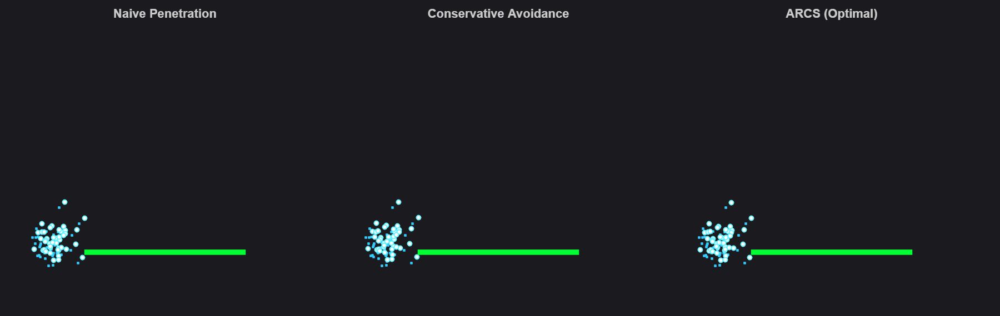
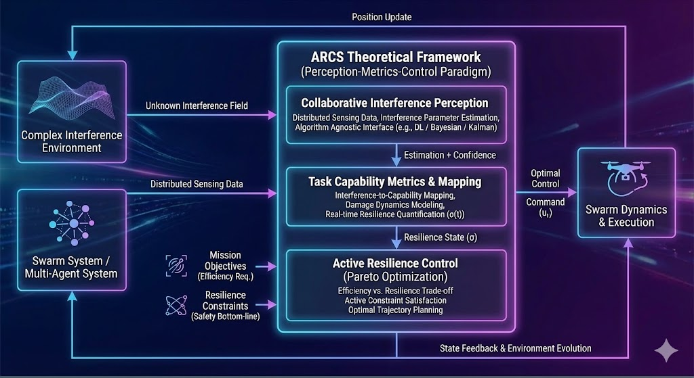
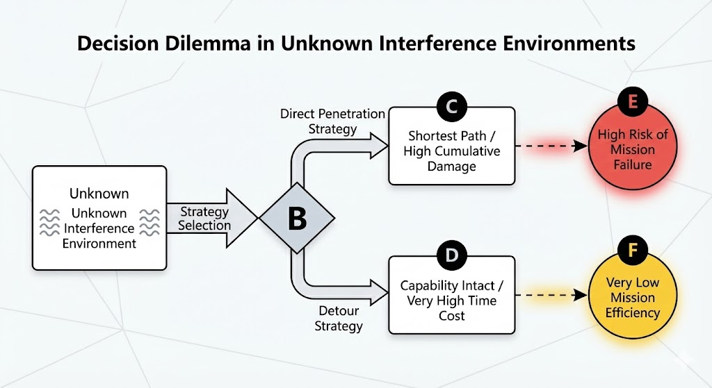
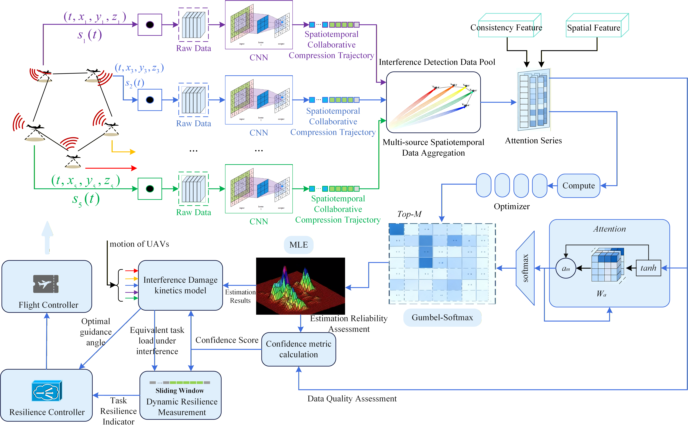

# ARCS: General Simulation Platform for Task Resilience Control of Swarms

### (Active Resilience Control for Swarms)

**Defining a General Research Paradigm for Swarm Survivability and Mission Collaboration in Hostile Environments**

> **[English Document]** | **[中文文档]**
> **Official Implementation**: The paper "Active Resilience Control for UAV Swarms: A Closed-Loop Framework Integrating Collaborative Perception and Dynamic Metrics" (Submitted to *Reliability Engineering & System Safety*).

---

<div align="center">



<em>Figure: ARCS builds an open research platform for "Interference Perception — Capability Metric — Resilience Control", supporting simulation experiments shifting from "Passive Efficiency Optimization" (Center) to "Active Resilience Control" (Right).</em>
</div>

---

## 📖 1. ARCS Platform: General Theory and Simulation Architecture

ARCS aims to break the limitations of single algorithms and establish a general scientific paradigm of **"Perception-Metric-Control"**. This paradigm **derives from our fundamental research on swarm mission collaboration mechanisms in complex interference environments [1]**, aiming to provide a standardized research foundation for the field.

### 1.1 The Scientific Paradigm: Defining the "Perception-Metric-Control" Triad

The platform abstracts swarm resilience research into a coupled problem of three core dimensions, supporting modular exploration:

1. **Perception Dimension: Interference Perception**
* **Scientific Challenge**: The essence of complex environments is the presence of **interference fields** with unknown spatiotemporal distributions. Individual agents are limited by observation range and lack distributed collaborative advantages.
* **Platform Definition**: Utilizing the spatiotemporal distribution characteristics of the swarm, treating it as a "Distributed Sensor Array". ARCS supports various collaborative estimation algorithms (e.g., STCL-NN) to achieve dynamic reconstruction of interference models, parameters, and **Confidence**.


2. **Metric Dimension: Task Capability Metrics**
* **Scientific Challenge**: Physical layer interference (e.g., SNR drop) is difficult to directly guide decision-layer planning. A quantitative mapping mechanism from "Environmental Interference" to "Task Consequences" is needed.
* **Platform Definition**: ARCS introduces the concept of **"Equivalent Task Capability"** and **Interference Damage Dynamics Equations**. It quantifies multi-source heterogeneous interference as the physical decay of the swarm's ability to complete functional tasks, thereby achieving real-time measurement of task resilience metrics.


3. **Control Dimension: Active Resilience Control**
* **Scientific Challenge**: Systems often fall into a zero-sum game between "Task Efficacy" and "Task Resilience". Traditional methods often oscillate between passive avoidance (high time cost) or blind traversal (high risk).
* **Platform Definition**: ARCS establishes the control philosophy of **"Resilience as a State"**. The platform supports designing active resilience control laws that dynamically seek the Pareto Frontier of optimal efficacy while ensuring a minimum capability baseline (resilience constraint).


### 1.2 The Core Architecture: Closed-Loop Framework

To translate the above scientific paradigm into an executable simulation system, ARCS establishes a standardized **Three-Layer Closed-Loop Architecture** (as shown in Fig. 1).

<div align="center">

<em>Fig 1: Schematic of the Standardized ARCS Three-Layer Closed-Loop Framework</em>
</div>

* **Input End**: Receives physical field information from the "Complex Interference Environment" and distributed sensor data from the "Swarm System".
* **Core Processing Layers**:
* **Collaborative Perception Layer**: Acts as the information gateway, transforming raw sensor data into structured environmental knowledge (Estimates + Confidence).
* **Metric & Mapping Layer**: Acts as the **"Bridge"** connecting the physical world and the control world. It maps environmental information to the system's current **"Task Resilience State ()"** via damage dynamics models.
* **Active Resilience Control Layer**: Acts as the decision brain, performing dynamic trade-offs (Pareto optimization) between efficacy targets and safety baselines based on current resilience states.


* **Execution & Feedback End**: Control commands update agent states, which in turn alter their observation perspectives, forming a dynamic coupled closed-loop.

---

**💡 Foundational Work & Premier Instantiation**

The **first complete theoretical construction and mathematical implementation** of the above general framework is detailed in our foundational paper **[1]**:

* **Perception Layer Implementation**: Proposed the **STCL-NN** (Spatiotemporal Collaborative Localization Neural Network) algorithm.
* **Metric Layer Implementation**: Established a resilience metric model based on **Damage Dynamics Equations**.
* **Control Layer Implementation**: Designed an optimal controller based on **PMP (Pontryagin's Minimum Principle)**.

> **[1]** *Zeng Y, Zhuang X, Li J, et al. Active Resilience Control for UAV Swarms: A Closed-Loop Framework Integrating Collaborative Perception and Dynamic Metrics. Reliability Engineering & System Safety, 2025 (Under Review).*

---

## 🏗️ 2. Premier Instantiation: Baseline Scenario & Implementation

This chapter details the **Premier Instantiation** based on our foundational paper.

### 2.1 The Baseline Scenario

ARCS includes the classic "Swarm Traversal and Search" task scenario from the paper:

* **Task Goal**: A formation of 5 UAVs must traverse a  km unknown area to reach a destination, preserving enough "Effective Functional Payload" to complete subsequent missions.
* **Dynamics Constraints**: For every second exposed to the interference field, UAVs suffer irreversible physical decay of task capability according to specific **Damage Dynamics Equations**.

**The Dilemma & Core Challenge:**

<div align="center">

<em>Fig 2.1: Typical Decision Dilemma in Unknown Interference Environments</em>
</div>

> **❓ Core Scientific Challenge**
> Under conditions of uncertain and complex interference, is there a control paradigm that can **continuously guarantee the system's task capability baseline (Resilience)** while achieving **high task execution efficiency (Efficacy)**?

### 2.2 Implementation & File Organization

ARCS employs a modular design, precisely mapping the paper's algorithms to the general framework (as shown in Fig. 2).

<div align="center">

<em>Fig 2: Schematic of the Premier Instantiation from STCL-NN Perception to PMP Resilience Control</em>
</div>

**File Organization:**

```text
/ARCS_Root
├── Main.m                  % [Entry] Simulation Entry: Scenario config & Benchmark scheduling
├── ResilienceSim.m         % [Engine] Simulation Core: Discrete time stepping & Data dispatch
├── Modules/                % [Components] Core Algorithm Implementation
│   ├── STCL_NN.m           % [Perception] Collaborative Localization (STCL-NN Implementation)
│   ├── calcResilience.m    % [Metric] Damage Dynamics Calculation (Resilience Metrics Implementation)
│   ├── flyController.m     % [Control] PMP Optimal Controller (Control Law Implementation)
│   └── ...                 % [Tools] Visualization scripts
└── Results/                % [Data] Storage for generated .mat files
└── Figs/                   % [Charts] Storage for generated .fig files

```

---

## 🧩 3. Core Algorithms & Implementation

This section details the engineering implementation of the ARCS core modules, strictly following the **"Perception-Metric-Control"** closed-loop theoretical framework.

### 3.1 Simulation Engine Architecture: Closed-Loop Scheduling

**Core Module**: `ResilenceSim.m` (Simulation Engine)

`ResilenceSim.m` is the core scheduler. It maintains the global clock and coordinates data exchange between sub-modules within each Time Step.

**System Dataflow**:

<div align="center">


<em>Fig 3.1: ARCS Simulation Engine Closed-Loop Dataflow</em>
</div>

### 3.2 Collaborative Perception Layer: STCL-NN Module

**Module Correspondence**: `Modules/STCL_NN_Real.m`

To solve interference source localization in high-noise environments, this project implements the **STCL-NN** module. It adopts a **"Physics-Guided" Hybrid Architecture**.

As shown in Fig. 3 (in the Paper), the code strictly follows a three-stage processing pipeline:

#### 3.2.1 Stage 1: Distributed Feature Extraction & Spatiotemporal Compression

The code constructs a feature extractor based on **Sliding Window Convolution Operators**.

| Paper Term | Code Function | Mechanism Analysis |
| --- | --- | --- |
| **Gated Acquisition** | `STCL_NN_Real` | **Gated Mechanism**: Introduces `MIN_ATTENUATION` threshold; activates recording only when signal exceeds noise floor. |
| **CNN Feature Compression** | `optimizedSlidingWindow` | **Spatiotemporal Convolution**: Uses sliding windows to extract cumulative energy and trend slopes, mapping raw data to "Spatiotemporal Collaborative Compression Trajectories". |

#### 3.2.2 Stage 2: Attention-based Collaborative Sample Screening

The code implements a soft screening strategy based on **Attention Mechanisms**.

| Paper Term | Code Function | Mechanism Analysis |
| --- | --- | --- |
| **Feature Embedding** | `calculateWindowConfidence` | **Feature Embedding**: Extracts **Consistency Features** (Physical decay conformity) and **Spatial Features** (Geometric diversity). |
| **Attention Selection** | `selectDiverse...Points` | **Attention Screening**: Calculates "Information Confidence Weight" and uses Top-M strategy to construct high-confidence datasets. |

#### 3.2.3 Stage 3: Nonlinear Identification & Confidence Evaluation

Regresses to the physical model to complete precise inversion.

| Paper Term | Code Function | Mechanism Analysis |
| --- | --- | --- |
| **MLE Solution** | `nonlinearLeastSquaresFit` | **MLE Solver**: Uses **LM Algorithm** to iteratively solve the nonlinear least squares problem for parameter . |
| **Confidence** | `calculateFinalConfidence` | **Multi-dimensional Confidence**: Synthesizes fitting residuals and spatial configuration to generate global confidence . |

---

### 3.3 Dynamic Metric Layer: Damage Dynamics & Resilience

**Module Correspondence**: `Modules/calcResilience.m`

#### 3.3.1 Damage Dynamics Equation

The code implements the differential equation described in Eq. (14) of the paper:


* **Logic**: Uses discrete Euler method.  corresponds to the damage coefficient, and  corresponds to perception confidence.

#### 3.3.2 Dynamic Performance Factor

* **Logic**: Calculates the real-time performance factor . The code fuses historical observations with future predictions to evaluate the current capability margin.

---

### 3.4 Resilience Control Layer: Multi-Mode Flight Controller

**Module Correspondence**: `Modules/flyController.m`

`flyController.m` integrates three comparison strategies, switchable via `simParams.CtrlMode`.

#### 3.4.1 Benchmark Implementation

* **C0: Open-loop Baseline**
* **Param**: `CtrlMode = 0`
* **Logic**: Maintains formation only, ignores interference. Tests raw lethality.


* **C1: Artificial Potential Field (APF)**
* **Param**: `CtrlMode = 1`
* **Logic**: Traditional reactive avoidance generating virtual repulsive forces.


#### 3.4.2 Proposed Algorithm: PMP Active Resilience Control

* **Param**: `CtrlMode = 3`
* **Logic**: Implements the optimal control law based on the ** State Machine**.

```matlab
% PMP Optimization Logic (Simplified)
if sigma_t >= sigma0       % Regime A: Efficiency-First
    target_efficiency = 0.95; 
elseif sigma_t >= sigma_l  % Regime B: Resilience-Critical
    delta_sigma = (sigma0 - sigma_t)/(sigma0 - sigma_l);
    target_efficiency = max(0.55, 0.85 - 0.3*delta_sigma); 
end

```

---

## 📊 4. ARCS Benchmark

ARCS provides a standardized set of experiments, integrating the full-process comparative experiments from Chapter 4 of the paper.

### 4.1 Experiment 1: Collaborative Perception Performance

**Command**: `Main('exp01fig01', true)`

Evaluates STCL-NN localization accuracy under high noise.

* **Conclusion**: Validates the **"Cooperative Gain"** mechanism. As nodes increase, STCL-NN leverages spatial diversity to suppress noise, converging error to  km.

<div align="center">


<em>Fig 4.1: Comparison of Interference Source Localization Results</em>
</div>

### 4.2 Experiment 2: Dynamic Resilience Measurement Verification

**Command**: `Main('exp02', true)`

Validates the fidelity and predictive capability of the Damage Dynamics model.

* **Conclusion**: The predictive indicator  provides early warning of degradation risks and sensitively reflects survival potential improvements from heading adjustments, demonstrating **"Forward-looking"** assessment capabilities.

### 4.3 Experiment 3: Control Strategy Comparison

**Command**: `Main('exp03fig01' ~ 'exp03fig04', true)`

| Exp ID | Strategy | Typical Behavior | Scientific Conclusion |
| --- | --- | --- | --- |
| `'exp03fig01'` | **Uncontrolled** | ⏱️ Fastest / 📉 **Mission Failure** | Proves "Efficiency First" leads to system collapse. |
| `'exp03fig02'` | **APF** | 🛡️ Payload Intact / ⚡ **Severe Jitter** | Proves local avoidance is overly conservative and inefficient. |
| `'exp03fig03'` | ** Control** | 📉 **Oscillation** | Proves global metric feedback causes gradient coupling. |
| `'exp03fig04'` | **PMP- (Ours)** | ✅ **Optimal Balance** | Achieves **Pareto Optimality** between efficacy and resilience. |

<div align="center">


<em>Fig 4.3: Comparison of Trajectories and Payload Curves under Different Strategies</em>
</div>

---

## 📝 5. Citation

ARCS is an open research project. If you use this code or extend new scenarios based on this framework, please cite our foundational work:

```bibtex
@article{zeng2025active,
  title={Active Resilience Control for UAV Swarms: A Closed-Loop Framework Integrating Collaborative Perception and Dynamic Metrics},
  author={Zeng, Yifan and Zhuang, Xuebin and Li, Jinning and Wu, Meng},
  journal={Reliability Engineering \& System Safety},
  year={2025}
}

```

## 📧 6. Contact

This project is developed and maintained by **Yifan Zeng**.
If you have questions about the code, find bugs, or are interested in academic collaboration, please contact:

* **Personal Email (Permanent)**: [zyfkd@qq.com](mailto:zyfkd@qq.com) (Recommended)
* **Academic Email**: [zengyf29@mail2.sysu.edu.cn](mailto:zengyf29@mail2.sysu.edu.cn)
* **Requirements**: MATLAB R2020b or higher (Pure .m implementation, no toolboxes required).
* **Copyright**: © 2025 School of Systems Science and Engineering, Sun Yat-sen University (SYSU). MIT License.
