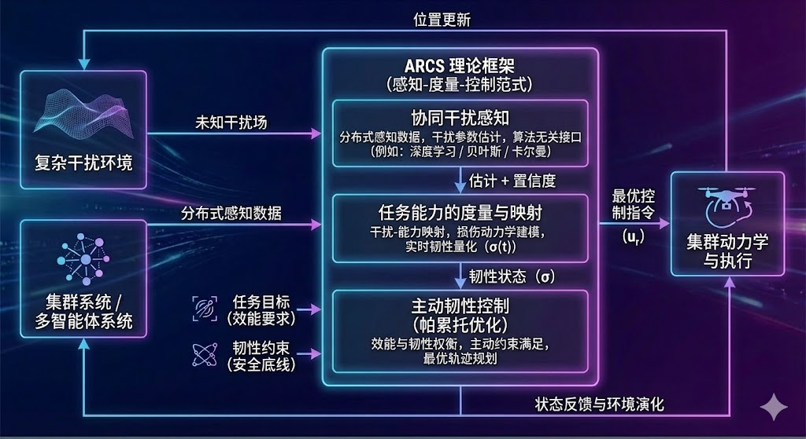
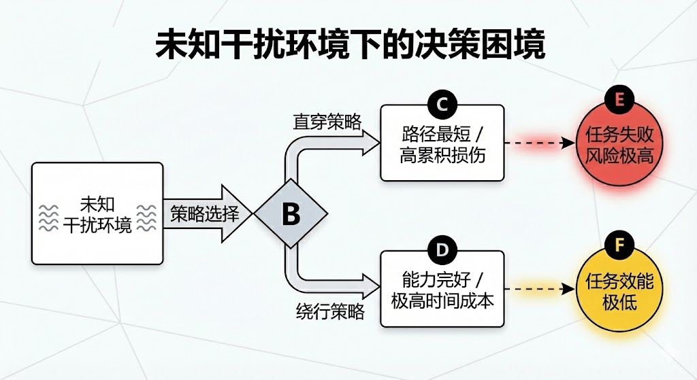
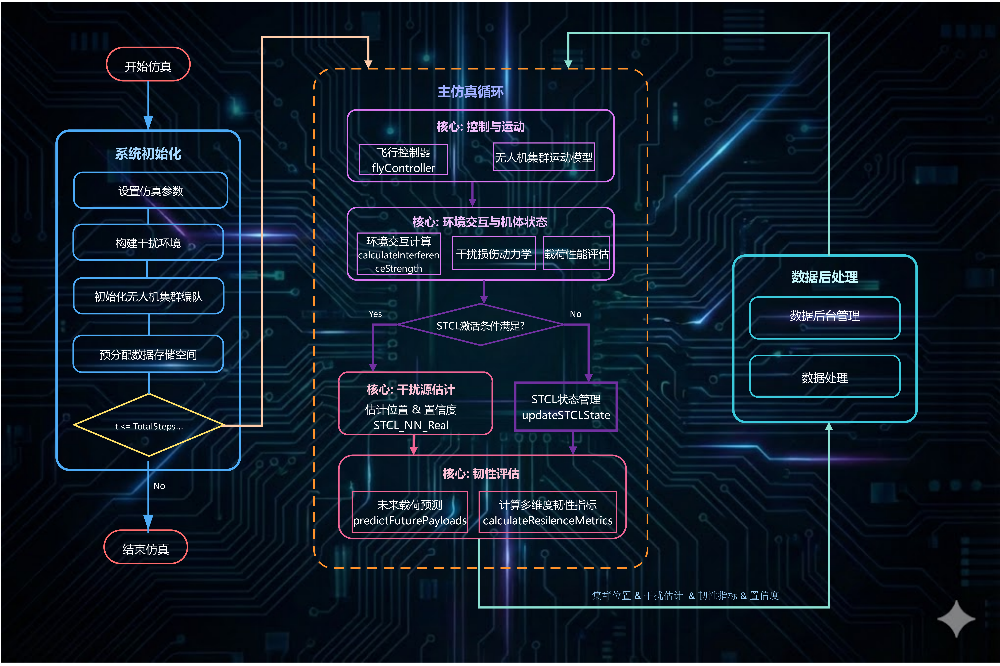
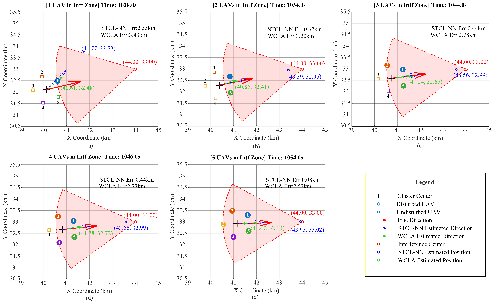
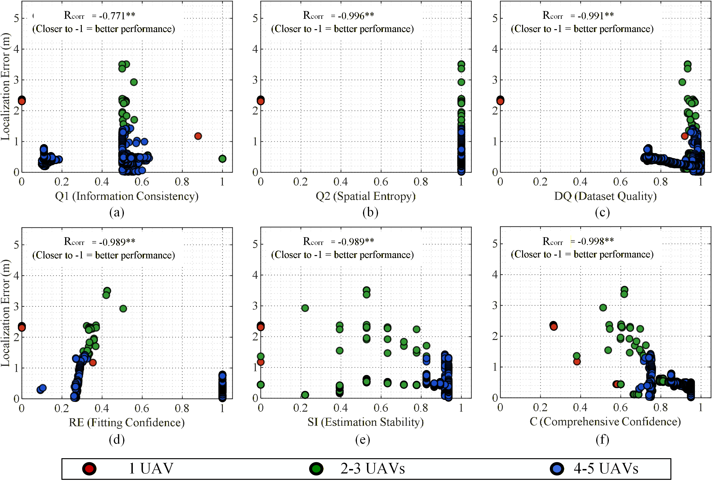
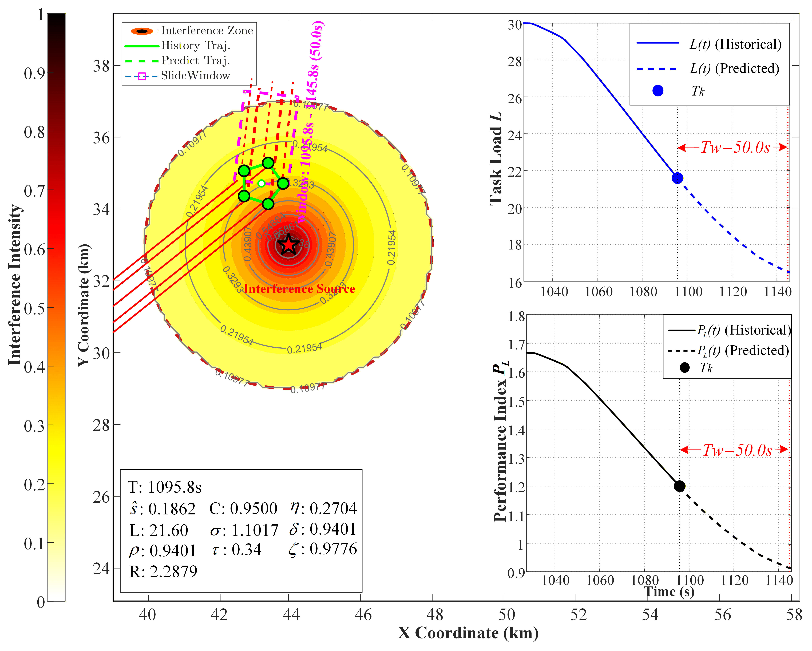
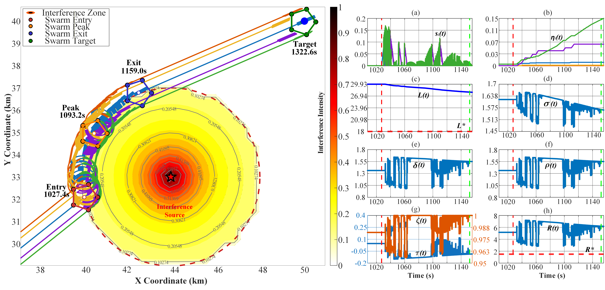
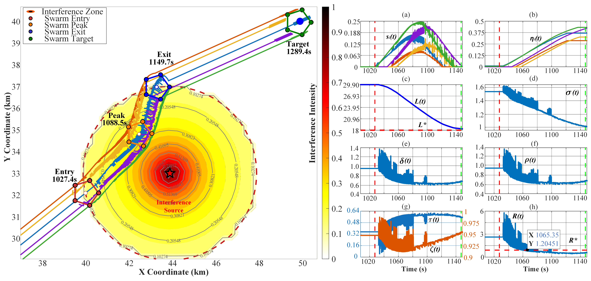
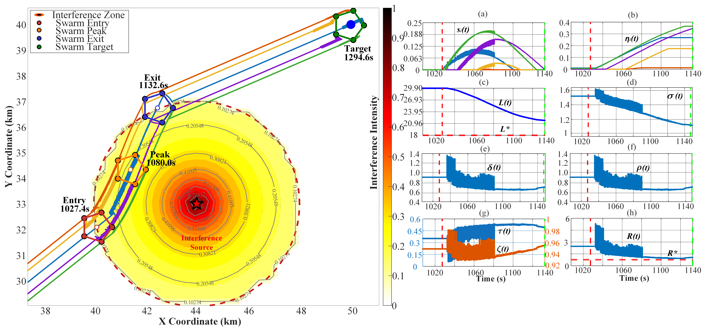

# ARCS: 通用集群任务韧性控制仿真平台
### (Active Resilience Control for Swarms)

**定义对抗环境下集群生存与任务协同的通用研究范式**

[](https://www.mathworks.com/products/matlab.html)
[](https://opensource.org/licenses/MIT)
[]()

> **[English Document](./README.md)** | **[Chinese Document](./README_CN.md)**
>
> **官方实现**: 论文 "Active Resilience Control for UAV Swarms: A Closed-Loop Framework Integrating Collaborative Perception and Dynamic Metrics" (已投稿至 *Reliability Engineering & System Safety*).

---

<div align="center">
  
  <br>
  <em>图示：ARCS 构建了一个开放的"干扰感知—任务能力度量—韧性控制"研究平台，支持从"被动效能优化"（中）转向"主动韧性控制"（右）的仿真实验。</em>
</div>

---

## 📖 1. ARCS 平台：主动韧性控制的通用理论与仿真架构

ARCS 旨在打破单一算法的局限，建立一套通用的**"感知—度量—控制"**科学范式。该范式**源于我们对集群在复杂干扰环境下任务协同机理的基础研究 [1]**，旨在为该领域提供标准化的研究底座。

### 1.1 科学范式：定义"感知—度量—控制"三元组 (The Scientific Paradigm)

本平台将集群韧性研究抽象为三个核心维度的耦合问题，支持研究者在此框架下进行模块化探索：

1.  **感知维度：干扰感知 (Interference Perception)**
    * **科学挑战**：复杂环境的本质是存在时空分布未知的**干扰场**。单体智能受限于观测范围，缺乏集群级的分布式协同优势。
    * **平台定义**：利用集群的时空分布特性，将其视为"分布式传感器阵列"。ARCS 支持接入各类协同估计算法（如 STCL-NN），实现对干扰模型、参数及**置信度 (Confidence)** 的动态重构。

2.  **度量维度：任务能力度量 (Task Capability Metrics)**
    * **科学挑战**：物理层的干扰（如信噪比下降）难以直接指导决策层的规划。我们需要建立从"环境干扰"到"任务后果"的定量映射。
    * **平台定义**：ARCS 引入**"等效任务能力"**概念和**干扰损伤动力学方程**。它将多源异构的干扰统一量化为能力的物理损耗，实现任务韧性指标的实时度量。

3.  **控制维度：主动韧性控制 (Active Resilience Control)**
    * **科学挑战**：系统往往陷入"任务效能"与"任务韧性"的零和博弈。传统方法常处于被动规避（高耗时）或盲目穿越（高风险）的极端。
    * **平台定义**：ARCS 确立了**"韧性即状态 (Resilience as a State)"**的控制理念。平台支持设计主动韧性控制律，在保证最低能力底线（韧性约束）的前提下，动态寻找效能最优的帕累托前沿。

### 1.2 核心架构：主动韧性控制闭环原理框架 (The Core Architecture)

为了将上述科学范式转化为可执行的仿真系统，ARCS 建立了一个标准化的**三层闭环架构**（如图 1 所示）。

<div align="center">
  
  <br>
  <em>图 1：标准化的 ARCS 三层闭环框架原理图</em>
</div>

* **输入端**：接收来自"复杂干扰环境"的物理场信息和"集群系统"的分布式传感数据。
* **核心处理层**：
    * **协同干扰感知层**：将杂乱的原始传感数据转化为结构化的环境知识（估计值 + 置信度）。
    * **任务能力的度量与映射层**：通过干扰损伤动力学模型，将环境信息映射为**"任务韧性状态 ($\sigma$)"**。
    * **主动韧性控制层**：基于韧性状态，在效能目标与安全底线之间进行动态权衡（帕累托优化）。
* **执行与反馈端**：控制指令更新智能体状态，进而改变其观测视角，形成动态耦合闭环。

---

**💡 学术起源与典范实现 (Foundational Work)**
上述通用框架的**首次完整理论构建与数学实现**详见我们的基础论文 **[1]**：
* **感知层**：提出了 **STCL-NN** (时空协同定位神经网络) 算法。
* **度量层**：建立了基于**损伤动力学方程**的韧性度量模型。
* **控制层**：设计了基于 **PMP (庞特里亚金极小值原理)** 的最优控制器。

> **[1]** *Zeng Y, Zhuang X, Li J, et al. Active Resilience Control for UAV Swarms: A Closed-Loop Framework Integrating Collaborative Perception and Dynamic Metrics. Reliability Engineering & System Safety, 2025 (Under Review).*

---

## 🏗️ 2. 典范实例构建：基础场景与框架实现

本章详细阐述基于基础论文的**首次典范实例构建 (Premier Instantiation)**。

### 2.1 基础场景定义 (The Baseline Scenario)

ARCS 内置了论文中经典的"集群穿越与搜索"任务场景：
* **任务目标**：5 架无人机编队穿越 $50 \times 50$ km 的未知干扰区。
* **动力学约束**：无人机依据**损伤动力学方程**遭受不可逆的任务能力衰减。

**决策困境与核心挑战 (The Dilemma & Core Challenge):**

<div align="center">
  
  <br>
  <em>图 2：未知干扰环境下的典型决策困境</em>
</div>

<br>

> **❓ 核心科学挑战 (Core Scientific Challenge)**
>
> 在不确定性的复杂干扰条件下，是否存在一种控制范式，能够在**持续保障系统任务能力底线（韧性）**的同时，实现**任务执行的高效性（效能）**？

### 2.2 框架实现与代码组织 (Implementation)

ARCS 采用模块化设计，将论文算法精准映射到通用框架中（如图 2）。

<div align="center">
     
     <br>
     <em>图 3：从 STCL-NN 干扰感知到 PMP 韧性控制的典范实例原理图</em> 
</div>

**代码文件组织结构 (File Organization):**

```text
/ARCS_Root
├── Main.m                  % [主程序] 仿真入口：负责场景配置与调度
├── ResilienceSim.m         % [引擎]   仿真内核：负责时间步进与数据分发
├── Modules/                % [组件库] 核心算法实现
│   ├── STCL_NN.m           % [感知层] 协同定位算法 (STCL-NN 实现)
│   ├── calcResilience.m    % [度量层] 损伤动力学计算 (Resilience Metrics 实现)
│   ├── flyController.m     % [控制层] PMP 最优控制器 (Control Law 实现)
│   └── ...                 % [绘图工具] 各类结果可视化脚本
└── Results/                % [数据仓] 存放仿真生成的 .mat 文件
└── Figs/                   % [图表仓] 存放生成的 .fig 图片

```
---

## 🧩 3. 核心算法详解与源码映射 (Core Algorithms & Implementation)

本节解析 ARCS 核心模块的工程实现，代码结构严格遵循 **"Perception-Metric-Control"** 闭环理论框架。

### 3.1 仿真引擎架构：闭环调度机制

**核心模块**：`ResilenceSim.m` (Simulation Engine)

`ResilenceSim.m` 是整个仿真系统的核心调度器，协调各子模块的数据交换。

**系统运行流程图 (System Dataflow)**:

<div align="center">
    
    <br>
    <em>图4: ARCS仿真引擎系统运行流程图 (ARCS Simulation Engine Architecture)</em>
</div>

### 3.2 协同感知层：STCL-NN 模块实现

**模块对应**：`Modules/STCL_NN_Real.m`

为了解决强噪声环境下的干扰源定位问题，本项目实现了论文提出的 **STCL-NN (Spatiotemporal Collaborative Learning Neural Network)** 模块。

STCL-NN 是一种**基于机理赋权的新型前馈神经网络**。
不同于依赖反向传播（BP）进行参数迭代的深度学习模型，STCL-NN 回归了神经网络 **"分层信息处理"** 的本质，通过**结构同构**与**机理嵌入**实现了免训练感知：

* **拓扑结构（Topology）**：完全保留了深度神经网络的 **"卷积特征提取 $\to$ 注意力筛选 $\to$ 非线性回归"** 的多层前馈结构。
* **权重生成（Weighting）**：摒弃了高代价的数据训练，直接将物理场方程（时空积分、衰减一致性）映射为网络层的 **固定权重与激活算子**。

这种设计既具备了神经网络强大的**非线性映射能力**，又拥有物理模型的**完全可解释性**，是"AI for Science"理念在集群感知领域的典型实践。

如图 3 (Fig. 3 in Paper) 所示，代码严格遵循三阶段处理流水线：

#### 3.2.1 Stage 1: 分布式特征提取与时空压缩

论文提出利用轻量级 CNN 进行"时空协同压缩轨迹"映射。在代码实现层面，构建了基于**滑动窗口卷积算子**的特征提取器，以捕捉局部信号的梯度变化。

| 论文概念 (Paper Term) | 源码函数 (Code Function) | 实现机制解析 (Mechanism) |
| :--- | :--- | :--- |
| **Gated Acquisition** | `STCL_NN_Real`<br>(Main Loop) | **门控采集机制**：<br>引入 `MIN_ATTENUATION` 阈值判断，仅当监测信号强度超过底噪时激活记录，对应论文中的事件触发机制。 |
| **CNN Feature Compression** | `optimizedSlidingWindow` | **时空卷积 (Convolution)**：<br>利用滑动窗口沿时间维度执行卷积操作 (Convolution Operation)。该过程提取了窗口内的累积能量与趋势斜率，将原始物理数据映射为论文所述的 "Spatiotemporal Collaborative Compression Trajectory"。 |

#### 3.2.2 Stage 2: 基于注意力的协同样本筛选

为了剔除 NLOS 噪声和离群点，代码实现了一套基于 **注意力机制 (Attention Mechanism)** 的软筛选策略，通过计算多维特征的置信度权重来实现数据净化。

| 论文概念 (Paper Term) | 源码函数 (Code Function) | 实现机制解析 (Mechanism) |
| :--- | :--- | :--- |
| **Feature Embedding** | `calculateWindowConfidence` | **特征嵌入**：<br>代码提取了两类高维特征用于计算注意力得分：<br>1. **一致性特征** (Consistency)：信号衰减符合物理规律的程度；<br>2. **空间特征** (Spatial Layout)：采样点的几何分布多样性。 |
| **Attention Selection** | `selectDiverseHighConfidencePoints` | **注意力筛选**：<br>计算每个采样点的 "Information Confidence Weight"。基于论文描述的 Top-M 策略，代码动态筛选出置信度最高的 $M$ 帧数据，构建高可信数据集 (High-confidence Dataset)。 |

#### 3.2.3 Stage 3: 非线性辨识与置信度评估

该阶段回归物理模型，完成从特征空间到物理参数的精确反演。

| 论文概念 (Paper Term) | 源码函数 (Code Function) | 实现机制解析 (Mechanism) |
| :--- | :--- | :--- |
| **MLE Solution** | `nonlinearLeastSquaresFit` | **MLE 求解器**：<br>基于筛选后的数据集，使用 **LM (Levenberg-Marquardt)** 算法迭代求解非线性最小二乘问题，快速收敛得到最优干扰参数 $\hat{\xi}$。 |
| **Confidence Quantification** | `calculateFinalConfidence` | **多维置信度量化**：<br>综合 MLE 拟合残差（模型符合度）和空间几何构型（观测完备性），生成全局置信度分数 $C \in [0,1]$，直接驱动后续的韧性控制决策。 |

---

### 3.3 动态度量层：损伤动力学与韧性计算
**模块对应**：`Modules/calcResilience.m` (核心算法) & `ResilenceSim.m` (调度)
**论文章节**：Section 2.2 (Metric Layer)
本模块负责建立"物理干扰"与"任务能力"之间的动态映射。为了解决传统静态指标滞后的问题，代码实现了一套**基于"幽灵仿真"的预测性度量框架**。
#### 3.3.1 损伤动力学方程 (Damage Dynamics)
代码实现了论文 Eq. (14) 描述的微分方程：
$$ \frac{\mathrm{d}\eta}{\mathrm{d}t} = -\beta \cdot [C(t) \cdot \hat{s}(t)] \cdot \eta(t) - \gamma \cdot \eta(t) $$
**核心逻辑**：将物理场强度映射为不可逆的能力损耗。

| 论文概念 (Paper Term) | 源码函数 (Code Function) | 实现机制解析 (Mechanism) |
| :--- | :--- | :--- |
| **Damage Evolution**<br>(Eq. 14) | `updateDamageFactors` | **离散化 Euler 积分**：<br>代码通过 `newDamage = currentDamage + (damageRate - recoveryRate) * dt` 实现微分方程的数值解。其中 `damageRate` 深度耦合了**感知置信度** (`Ck`) 与**物理场强度** (`interferenceStrength`)，实现了"感知不准则不过度更新"的鲁棒设计。 |
| **Self-Recovery** | `initializeDamageParameters` | **弹性恢复机制**：<br>引入 `gamma_recovery` 参数模拟系统的自修复能力。代码逻辑确保了在飞离干扰区后，系统能力可按指数规律回升，符合物理实际。 |

#### 3.3.2 基于模型预测的性能因子 $\sigma(t)$
**核心逻辑**：融合"历史观测"与"未来预测"，构建具有前瞻性的状态变量。

代码并没有使用简单的线性外推，而是构建了一个**加速预测器** (`predictFuturePayloads`)。该预测器利用当前感知的干扰模型参数 $\hat{\xi}$，在虚拟时空中推演集群未来的生存状态。

| 论文概念 (Paper Term) | 源码函数 (Code Function) | 实现机制解析 (Mechanism) |
| :--- | :--- | :--- |
| **Active Prediction**<br>(Model Predictive) | `predictFuturePayloads` | **"基于仿真"的有限时域状态外推**：<br>1. **预测仿真步长**：采用 `predDt = 5 * dt` 进行粗粒度快速推演；<br>2. **虚拟映射**：利用感知层输出的**估计参数** ($\hat{\alpha}, \hat{\beta}, \hat{d_0}$) 重构虚拟干扰场；<br>3. **动态终止**：当虚拟集群飞离干扰区或达到最大预测时域 (`maxPredictionTime`) 时自动停止。 |
| **Dynamic Weighted Fusion**<br>(Eq. 18) | `calculateResilienceMetrics` | **置信度门控融合**：<br>$\sigma(t)$ 的计算公式如下：<br>`sigma = ((1-conf)*Hist + conf*Pred) / Target`<br>**机制亮点**：利用置信度 `conf` 作为权重因子。当感知不可靠时退化为依赖历史数据，当感知精确时偏重未来预测，从而实现鲁棒性与前瞻性的最优平衡。 |

### 3.4 韧性控制层：多模式飞行控制器

**模块对应**：`Modules/flyController.m`

`flyController.m` 集成了三种对比策略，通过 `simParams.CtrlMode` 切换。

#### 3.4.1 基准算法实现 (Benchmark Implementation)

* **C0: 无控制基准 (Open-loop Baseline)**
* **参数**: `CtrlMode = 0`
* **逻辑**: 仅保留编队保持，不规避干扰，测试原始杀伤力。


* **C1: 人工势场法 (APF)**
* **参数**: `CtrlMode = 1`
* **逻辑**: 传统的反应式避障，产生虚拟排斥力。

#### 3.4.2 提议算法：PMP 主动韧性控制 (Proposed PMP Control)
* **模式参数**: `simParams.CtrlMode = 3`
* **核心机制**: 基于 $\sigma(t)$ 的**状态机切换**与**微分趋势补偿**。

本模块实现了论文 Eq. (25) 推导的最优控制律。区别于被动的阈值触发，代码引入了 $\dot{\sigma}(t)$ 项，实现了对性能衰减趋势的**主动预判与抑制**。

**1). 控制律实现机制解析 (Mechanism Analysis)**

| 理论概念 (Theoretical Term) | 源码逻辑 (Code Logic) | 物理含义 (Physical Meaning) |
| :--- | :--- | :--- |
| **PMP Costates ($\lambda_p, \lambda_s$)** | `efficiencyWeight` | **协态权值分配**：<br>代码将抽象的协态变量离散化为 $\sigma(t)$ 的分段函数，动态调节任务与生存的权重。 |
| **Active Trend Prediction** | `sigma_dot > 0` | **微分前馈 (D-Term)**：<br>当检测到性能回升趋势时，主动释放效率权重。这对应了协态方程随时间反向演化的预判特性。 |
| **Hamiltonian Min ($u^*$)** | `desiredDir` | **最优航向合成**：<br>通过向量加权合成当前时刻的最优控制量 $u^*$，即寻找帕累托前沿上的最优切点。 |

**2). 核心逻辑源码片段 (Core Implementation Snippet)**

```matlab
% --- A. PMP 状态机权值求解 (PMP State Machine) ---
% 计算相对于基线 sigma0 的偏差与变化率
sigma_deviation = sigma_t - sigma0;
sigma_dot = (sigma_t - prev_sigma) / dt;

% Regime 1: 性能充裕 (消耗冗余，加速任务)
if sigma_t >= sigma0
    target_efficiency = 0.95; 

% Regime 2: 韧性临界 (动态平衡，PMP 线性映射)
elseif sigma_t >= sigma_l 
    delta_sigma = (sigma0 - sigma_t) / (sigma0 - sigma_l);
    target_efficiency = max(0.55, 0.85 - 0.3 * delta_sigma); 

% Regime 3: 紧急保护 (底线优先)
else 
    target_efficiency = 0.45; 
end

% --- B. 主动趋势补偿 (Active Trend Compensation) ---
% 关键创新：若性能正在回升 (sigma_dot > 0)，提前释放效率权重
% 这模拟了 PMP 协态变量的动态预测特性，防止系统"过度避障"
if sigma_dot > 0 && sigma_t < sigma0
    alpha = 0.6; % 预调整系数
    target_efficiency = target_efficiency + alpha * sigma_dot * (1.0 - target_efficiency);
    target_efficiency = min(0.95, target_efficiency); 
end
```
---

## 📊 4. ARCS Benchmark (基准测试)

ARCS 提供了标准化的实验集，代码集成了论文第 4 章的全流程对比实验。

### 4.1 实验一：协同感知性能评估 (Collaborative Perception)

**运行指令**: `Main('exp01fig01', true)`

评估 STCL-NN 算法在强噪声下的定位精度。

* **结论**: 验证了 **"协同增益"** 机制。随着接入节点增加，STCL-NN 利用空间多样性有效抑制噪声，最终误差收敛至  km。

<div align="center">
    
    <br>
    <em>图5: 干扰源定位结果对比</em>
</div>

### 4.2 实验二：动态韧性度量验证 (Dynamic Resilience Measurement)

**运行指令**: `Main('exp02', true)`

验证损伤动力学模型的保真度及预测能力。各项指标实验结果如图6所示：
<div align="center">
    
    <br>
    <em>图6: 各项置信度指标与定位误差的相关性</em>
</div>

<div align="center">
    
    <br>
    <em>图7: 任务韧性的实时预测性度量</em>
</div>
* **结论**: 预测指标  能够提前预警退化风险，并敏锐反映航向调整带来的生存潜力提升，具备**"前瞻性"**评估能力。

### 4.3 实验三：韧性控制策略对比 (Control Strategy Comparison)

**运行指令**: `Main('exp03fig01' ~ 'exp03fig04', true)`

| 实验 ID | 策略名称 | 典型表现 | 科学结论 |
| --- | --- | --- | --- |
| `'exp03fig01'` | **无控制** | ⏱️ 最快 / 📉 **任务失败** | 证明了"效率优先"会导致系统能力崩溃。 |
| `'exp03fig02'` | **APF** | 🛡️ 载荷完好 / ⚡ **剧烈抖动** | 证明了局部避障过于保守，严重牺牲效率。 |
| `'exp03fig03'` | **基于R(t)的韧性控制** | 📉 **控制振荡** | 证明直接反馈全局指标会导致梯度耦合问题。 |
| `'exp03fig04'` | **基于$\sigma(t)$的韧性控制** | ✅ **最优平衡** | 实现了效能与韧性的 **帕累托最优**。 |

各种控制策略的飞行轨迹图和任务韧性性能指标可参见图8~图11，详情可参见基础论文[1]。
<div align="center">
    
    <br>
    <em>图8: 无控制实验结果（高效率但严重载荷损失）。垂直和水平红色虚线分别表示集群进入时间和任务需求基线。</em>
</div>

<div align="center">
    
    <br>
    <em>图9: APF自主干扰规避结果（高安全代价与过度机动）。垂直和水平红色虚线分别表示集群进入时间和任务需求基线。</em>
</div>

<div align="center">
    
    <br>
    <em>图10: 基于$R(t)$的主动弹性最优控制结果（控制振荡与载荷保护不足）。垂直和水平红色虚线分别表示集群进入时间和任务需求基线。</em>
</div>

<div align="center">
    
    <br>
    <em>图11: 基于$\sigma(t)$的主动弹性最优控制结果（平滑性、载荷与效率的最优平衡）。垂直和水平红色虚线分别表示集群进入时间和任务需求基线。</em>
</div>

下表从任务完成时间、有效载荷变化情况、控制策略触发次数以及任务韧性指标满足情况多个维度对四种控制策略进行了对比分析。
实验结果表明：所提出的策略实现了最高的有效载荷下限（21.77）和最低的控制触发次数（867）。
关键的是，它保持了相对较短的任务完成时间（1294.7~s），仅比理论下界（无控制）长1.25\%。
这验证了我们框架的核心逻辑：
通过将动态性能因子$\sigma(t)$作为实时被控变量进行精确调节，系统隐式地确保综合弹性$R(t)$在整个任务期间保持在安全基线$R^* $之上。
这证实了锚定$\sigma(t)$的控制成功实现了 **"韧性需求"与"控制效率"之间的权衡优化**，以边际效率代价实现了高的任务韧性。

**表：四种控制策略的关键性能指标对比**
| 控制策略 | 任务完成时间 (s) | 有效载荷范围 | 控制触发次数 | $R(t) \ge R^*$ 满足率 |
| :--- | :---: | :---: | :---: | :---: |
| 无控制 | 1278.7 | [14.73, 30.00] | 0 | 0% |
| APF控制 | 1321.9 | [27.88, 30.00] | 2416 | 100% |
| $R(t)$控制 | 1293.2 | [18.28, 30.00] | 2279 | 40% |
| **$\sigma(t)$控制（提出）** | **1294.7** | **[21.77, 30.00]** | **867** | **100%** |

---

## 📝 5. 引用与致谢

ARCS 是一个开放的科研项目，如果您在研究中使用了本代码库，请引用我们的基础工作：

```bibtex
@article{zeng2025active,
  title={Active Resilience Control for UAV Swarms: A Closed-Loop Framework Integrating Collaborative Perception and Dynamic Metrics},
  author={Zeng, Yifan and Zhuang, Xuebin and Li, Jinning and Wu, Meng},
  journal={Reliability Engineering \& System Safety},
  year={2025}
}

```

## 📧 6. 作者与联系方式 (Contact)

本项目由 曾逸凡 (Yifan Zeng) 开发与维护。 如果您对代码实现有疑问、发现 Bug 或有进一步的学术合作意向，欢迎通过以下方式联系：

  个人邮箱 (Permanent): zyfkd@qq.com (推荐，长期有效)      学术邮箱 (Academic): zengyf29@mail2.sysu.edu.cn


* **环境要求**：MATLAB R2020b 或更高版本（纯 .m 实现，无工具箱依赖）。
* **版权**：© 2025 中山大学 系统科学与工程学院 (SYSU). 遵循 MIT 协议。

```

```